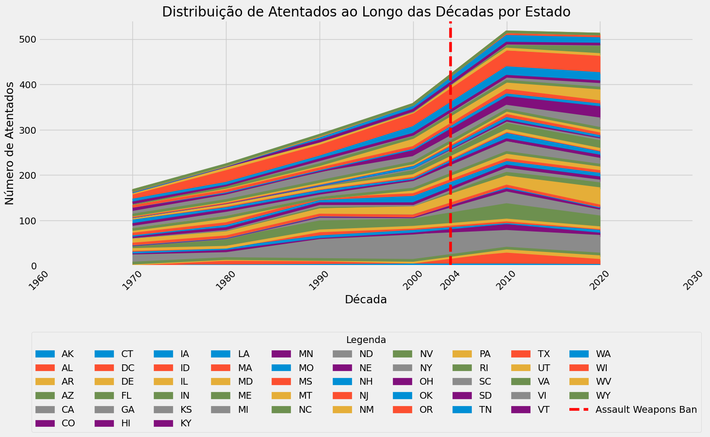
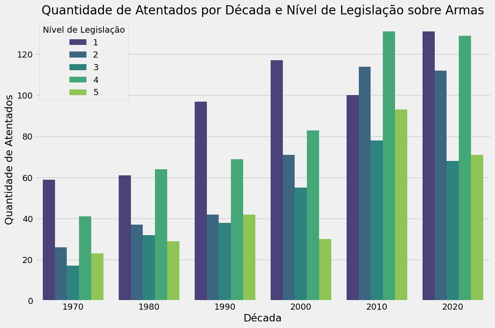

# Statistical Analysis of Cities in Relation to the Average Total Population

## Table of Contents
1. [Project Overview](#project-overview)
2. [Project Motivation](#project-motivation)
3. [Objectives](#objectives)
   - [General Objective](#general-objective)
   - [Specific Objectives](#specific-objectives)
4. [About the Dataset](#about-the-dataset)
5. [Tasks Completed](#tasks-completed)
   - [Data Loading and Initial Inspection](#data-loading-and-initial-inspection)
   - [Descriptive Analysis](#descriptive-analysis)
   - [Hypothesis Testing Analysis](#hypothesis-testing-analysis)
   - [Visualization](#visualization)
6. [Main Skills and Tools Used](#main-skills-and-tools-used)
7. [Challenges and Solutions](#challenges-and-solutions)
8. [Results and Insights](#results-and-insights)
9. [Next Steps](#next-steps)
10. [Acknowledgements](#acknowledgements)
11. [Technical Stack](#technical-stack)
12. [Files](#files)
13. [Contact](#contact)

---

## Project Overview
As the final project of Module 4: Statistics of 'Santander Coders 2023 | 2nd Semester - DS (3)', taught by Lucas Hermeto, this project analyzes the frequency of school shootings in the US relative to city population sizes from 1970 to 2022. I chose to continue with the analysis initiated in the [previous module](https://github.com/julianabpeixoto/neurons-frying/blob/main/santander_coders_2023_2semestre_trilha_data_science_banco_dados_projeto_final/README.md#main-skills-and-features-used) to deepen my learning and analysis. By using Python and data visualization libraries, the goal is to uncover patterns that can inform public policies and preventive measures.

## Project Motivation
This project was motivated by the need to better understand the population distribution of cities and how they compare to the national average. This understanding can help formulate public policies and allocate resources.

## Objectives

### General Objective
- Conduct a statistical analysis of the percentage distribution of cities in relation to the average total population.

### Specific Objectives
1. Load and inspect the dataset.
2. Perform a descriptive analysis of the data.
3. Formulate and test statistical hypotheses.
4. Visualize the results clearly and informatively.

## About the Dataset
The dataset used contains information about the population of various cities. The data was obtained from public sources and is used to perform statistical analyses and visualizations.

## Tasks Completed

### Data Loading and Initial Inspection
The data was loaded and inspected to understand its structure and content. This comprehensive process included checking data types, identifying missing values, and gaining an initial understanding of the data distribution.

### Descriptive Analysis
A descriptive analysis was performed to obtain basic statistics and distributions of the data. This included:
- Counting the number of records and unique entries in various columns.
- Identifying and handling missing values.
- Analyze data types and ensure they are appropriate for the intended analysis.

### Hypothesis Testing Analysis
Hypotheses were formulated and tested to answer specific questions about the distribution of cities in relation to the average total population.

### Visualization
Various visualizations were created using Python libraries such as Matplotlib and Seaborn to make the findings more accessible and understandable. These visualizations included:
- Bar charts showing the percentage distribution of cities.
- Pie charts to visualize the composition of categories.
- Area charts to show trends over time.
- Density plots to visualize the distribution of population data.

*Figure 1: Distribution of Incidents Over Decades by State*

*Figure 2: Number of Shootings by Decade and Level of Gun Legislation*

## Main Skills and Tools Used

- **Libraries**: Pandas, Matplotlib, Seaborn
- **Data Loading and Inspection**:
  - Loading datasets using Pandas
  - Inspecting data types, column names, and missing values
- **Statistical Analysis**:
  - Conducting hypothesis tests
  - Using statistical functions to summarize data
- **Data Visualization**:
  - Creating visual representations of the data to illustrate findings

## Challenges and Solutions
One of the main challenges was effectively manipulating and visualizing the data. By consulting documentation and forums, overcoming these challenges and creating clear and informative visualizations was possible.

## Results and Insights
The analysis uncovered several significant insights about the distribution of cities in relation to the average total population. For instance, it revealed that many cities have a population below the average, which could have profound implications for resource allocation and public policies.

## Next Steps
Future work could involve a deeper analysis of the factors contributing to the population distribution of cities, such as socioeconomic conditions and public policies. Additionally, predictive models could be applied to forecast future trends.

## Acknowledgements
I want to thank my instructor for the insights and feedback and the data community for their valuable support and resources.

## Files

- **Data**: Contains the raw dataset files.
  - [US School Shootings (1970-2022)](INCIDENT.csv)
  - [US Census Bureau, 2022 American Community Survey 1-Year Estimates](ACSDT1Y2022.B01003-Data.csv)
- **Code**: Contains the Python scripts and notebooks used for the analysis.
  - [Notebook](jbp_projeto_final_ada_estatistica_I.ipynb)

## Contact

Feel free to contact me with any questions or to collaborate on future projects.

- **Email**: jbertolucci@gmail.com
- **LinkedIn**: [Juliana Bertolucci Peixoto](https://www.linkedin.com/in/julianabpeixoto)
- **GitHub**: [JulianaBPeixoto](https://github.com/julianabpeixoto)

Thank you for visiting my portfolio!

---